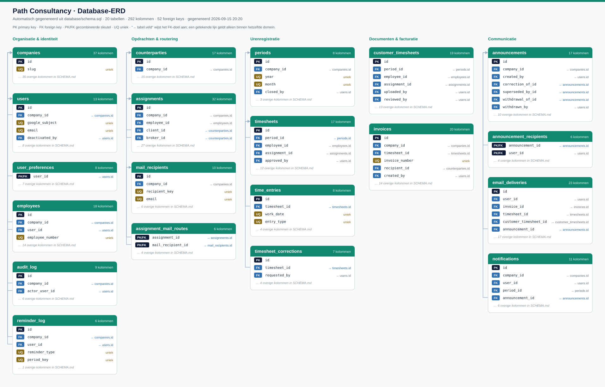

# Database-ERD (automatisch gegenereerd) — Path Uren & Facturatie

Dit bestand en [ERD-nieuw.svg](ERD-nieuw.svg) worden volledig gegenereerd door
`node scripts/generate-erd.mjs`, rechtstreeks uit `database/schema.sql`. Draai
dat script opnieuw na elke schemawijziging -- niets hier wordt met de hand
bijgewerkt.

## Overzicht

20 tabellen, 292 kolommen, 52 foreign keys. Per veld: `PK`, `FK`,
`PK/FK` of `UQ`. Achter een FK-veld staat de doeltabel en doelkolom; een
getekende verbindingslijn staat er alleen bij als bron en doel in hetzelfde
domein staan (anders wordt het diagram onleesbaar door kruisende lijnen over
de volle breedte).

## Domeinen

| Domein | Tabellen |
|---|---|
| Organisatie & identiteit | `companies`, `users`, `user_preferences`, `employees`, `audit_log`, `reminder_log` |
| Opdrachten & routering | `counterparties`, `assignments`, `mail_recipients`, `assignment_mail_routes` |
| Urenregistratie | `periods`, `timesheets`, `time_entries`, `timesheet_corrections` |
| Documenten & facturatie | `customer_timesheets`, `invoices` |
| Communicatie | `announcements`, `announcement_recipients`, `email_deliveries`, `notifications` |

## Verschil met de vorige ERD (database/ERD.md, 27-8-2026)

De vorige versie was handmatig gemaakt en dertien dagen niet bijgewerkt terwijl
`schema.sql` in die periode wel veranderde (commit 84654743 tot nu). Concreet
verschil:

- **Nieuwe tabel:** `reminder_log` (idempotentie voor de serverplanning van de
  vier herinneringstypen; uniek per medewerker/type/periode).
- **`companies`:** elf nieuwe kolommen -- `invoice_name_display`,
  `invoice_phone`, `invoice_email` en acht kolommen voor de vier
  herinneringstypen (`weekly_reminder_*`, `month_end_reminder_*`,
  `overdue_reminder_*`, `approval_reminder_*`) plus `mail_signature`.
- **`employees`:** vijf nieuwe kolommen `hours_monday` t/m `hours_friday`
  (optioneel eigen werkpatroon per weekdag).
- **`email_deliveries`:** `user_id` (nieuwe FK naar `users.id`),
  `timesheet_version`, `pdf_storage_key`, `dry_run`, `acceptance_test`, en de
  `channel`/`attachment_policy`-enums uitgebreid met nieuwe waarden
  (`timesheet_submission_receipt`, `timesheet_final_approval`,
  `password_reset`, `timesheet_receipt`, `other`).
- Tabelaantal 19 → 20, foreign keys 49 → 52.

De oude `ERD.md`/`ERD.svg`/`ERD-detail.svg` blijven staan zodat het verschil
zichtbaar blijft; verwijder ze pas als dit nieuwe diagram is goedgekeurd.
