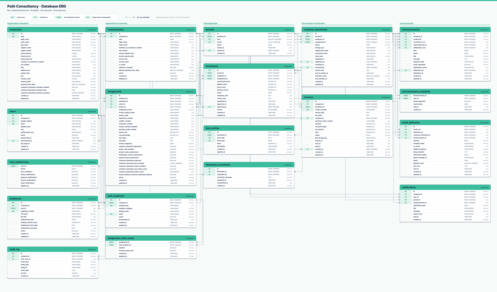

# Database ERD — Path Uren & Facturatie

De definitieve ERD is als schaalbare vector beschikbaar in [ERD.svg](ERD.svg).
Het diagram is gebaseerd op het actuele `schema.sql` en toont alle 19 tabellen, hun belangrijkste
primaire en foreign keys en de relaties tussen de functionele domeinen.

## Domeinen

| Domein | Tabellen |
|---|---|
| Identiteit en beheer | `companies`, `users`, `user_preferences`, `audit_log` |
| Mensen en opdrachten | `employees`, `counterparties`, `assignments` |
| Uren en perioden | `periods`, `timesheets`, `time_entries`, `timesheet_corrections` |
| Routes en documenten | `mail_recipients`, `assignment_mail_routes`, `customer_timesheets` |
| Facturatie en communicatie | `invoices`, `announcements`, `announcement_recipients`, `notifications`, `email_deliveries` |

Bij een schemawijziging moeten `schema.sql`, de bijbehorende migration en `ERD.svg` samen worden
bijgewerkt.
